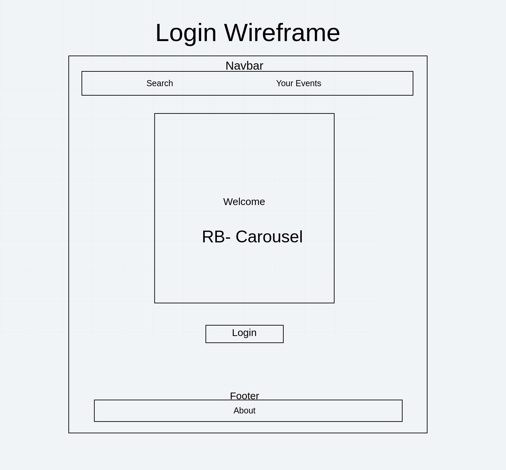
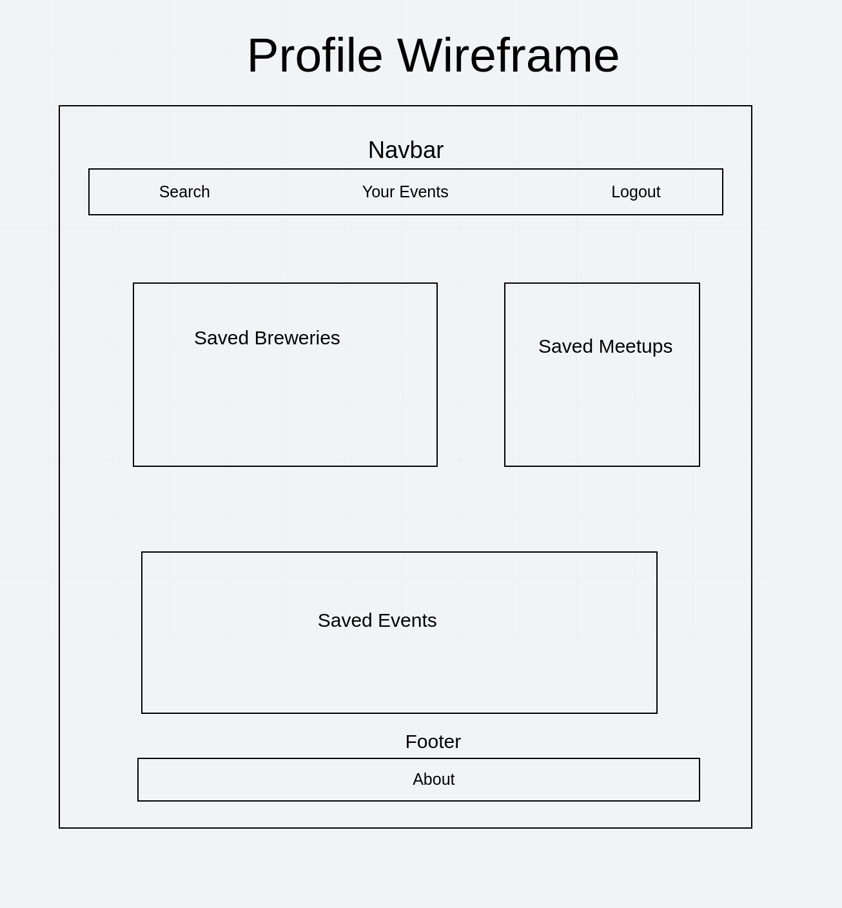
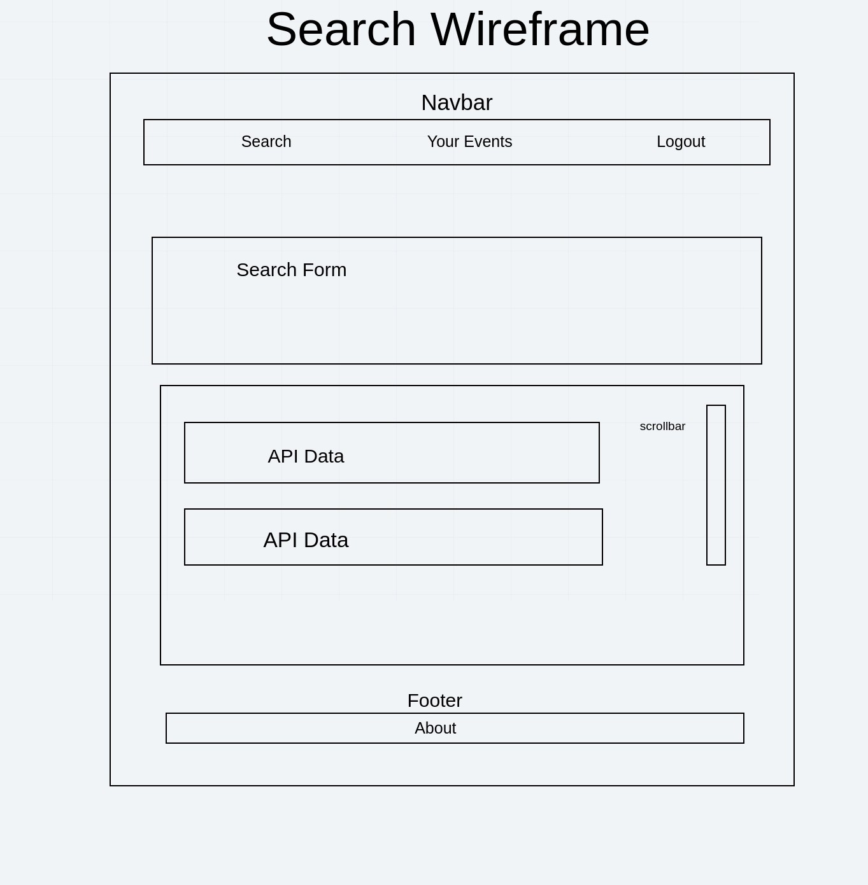
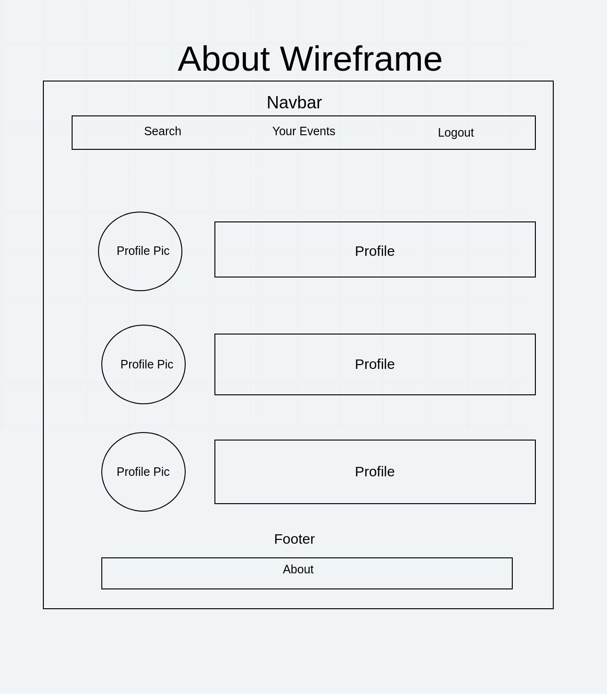

# Post It

### Team POST
- **Miriam Silva**
- **Joshua Haddock**
- **Patrick Laurion**

### Version: 1.1.1

## Overview

This app allows the user to search a potential city they want to travel to and date(s) they will be there . Upon searching they will be shown event, restaurant, and local brewery data gathered from Ticketmaster, Yelp, and BreweryDB.

## Getting Started
A deployed version of our site can be found [here](https://where2gonow.xyz/).

## Architecture
Site was desiged using React and React-Bootstrap on the frontend and node.js for backend. The frontend application is broken down into multiple components for each working part of the page, as per industry standards. While bootstrap is incorprated, any additional styling is done on a seperate css file that is accessed from a seperate folder.

The API is similarly broken up into models and modules.

## Credit and Collaborations

This project was worked on equally amongst the three developers.
Michelle Ferreirae aided in consultation and debugging.

### APIs

[Brewery DB](https://www.brewerydb.com/)

[Yelp](https://www.yelp.com/developers)

[Ticketmaster](https://developer.ticketmaster.com/products-and-docs/apis/getting-started/)

### Image Attributions

[Football vector created by pikisuperstar - www.freepik.com](https://www.freepik.com/free-photos-vectors/football)

[Restaurant vector created by macrovector - www.freepik.com](https://www.freepik.com/free-photos-vectors/restaurant)

[Background vector created by vectorpocket - www.freepik.com](https://www.freepik.com/free-photos-vectors/background)

[Banner vector created by macrovector - www.freepik.com](https://www.freepik.com/free-photos-vectors/banner)

[Design vector created by macrovector - www.freepik.com](https://www.freepik.com/free-photos-vectors/design)

## Collaborative Agreement

**Logistical**

# Cooperation Plan

Every person on your team is an asset. This is your chance to discover the hidden strengths and areas for growth for each team member.

## Describe at least:

What are the key strengths of each person on the team?
- Miriam: Server, Front
- Joshua: Server, Bootstrap
- AJ: Front, Server
- Patrick:

How can you best utilize these strengths in the execution of your project?
- Being able to switch off. Pair programming so we all know what's going on at all times

In which professional competencies do you each want to develop greater strength?
- Pair programming will allow us to learn from each other

Knowing that every person in your team needs to understand all aspects of the project, how do you plan to approach the day-to-day work?
- morning meet ups and merge party

# Conflict Plan

Your team should agree on a process for handing disagreements, should they arise. It is better to have a plan in place ahead of time so you can all refer back to it when necessary.

## Describe at least:

What will be your group’s process to resolve conflict, when it arises?
- address in house right away if not getting resolved bring in Michelle

What will your team do if one person is taking over the project and not letting the other members contribute?
- address it in house right away then bring Michelle in 

How will you approach each other and the challenges of the project knowing that it is impossible for all members to be at the exact same place in understanding and skill level?
- assume the best intentions, speak to each other with kindness

How will you raise concerns to members who are not adequately contributing?
- speak to them individually

How and when will you escalate the conflict if your resolution attempts are unsuccessful?
- speak to the person first, if you feel that changes did happen bring Michelle in

# Communication Plan

Before beginning to tackle the project, determine how your group will communicate with each other. This is not an individual effort. Make sure everyone feels comfortable with the identified methods of speaking up.

## Describe at least:

What hours will you be available to communicate?
- 9-6pm

What platforms will you use to communicate (ie. Slack, phone …)?
- slack, trello, virtual class room

How often will you take breaks?
- Lunch Break 12-1 / small breaks self police. If you plan on being away for an extended time let the team know

What is your plan if you start to fall behind?
- Remember the MVP. Let the group know if you are falling behind on something assigned to you 

How will you communicate after hours and on the weekend?
- We will communicate via Slack. 

What is your strategy for ensuring everyone’s voice is heard?
- Morning, afternoon merge party

How will you ensure that you are creating a safe environment where everyone feels comfortable speaking up?
- Give everyone the space to speak freely

# Work Plan

Explain your work plan to track whether everyone is contributing equally to all parts of the project, and that each person is working on “meaty” problems. This should prevent “lone wolf” efforts and “siloed” efforts.

## Describe at least:

How you will identify tasks, assign tasks, know when they are complete, and manage work in general?
- Morning round table
What project management tool will be used?
- Trello

# Git Process

Plan out what your team’s Git workflow looks like for coding tasks.

## Describe at least:

What components of your project will live on GitHub?
- All of it

How will you share the repository with your teammates?
- Create a team so we all have access

What is your Git flow?
- pull in the morning. Push in the evening

Will you be using a PR review workflow? If so, consider:
How many people must review a PR? will review as a group

Who merges PRs? everyone that has something to merge

How often will you merge? 1- 2 times daily

How will you communicate that it’s time to merge? It will be a set time 5pm

# User Stories

- As a User, i would like to have the ability to search for a destination and find events in the area so i can quickly find something to do when i visit that destination.

- As a User, i would like to Save events and into my profile page so that i can refer to them at a later date.

- As a Beer Enthusiast, i would like to have the ability to search for various brewerys within a given destination so that i can try new beer!

- Being a Beer enthusiast, i would like to save all of my favorite brewerys so that i can tell my friends about them.

- Moving to a new location is hard. As a user who is moving, i would like to be able to search for different social events so that i can meet some of the locals who's interests match my own.
## Vision
**What is the vision of this product?**

- Our product is designed to help people in a social media world unplug from their online lives and go out into the real world to enjoy events and brewerys

**What pain point does this project solve?**

- After a global pandemic has pleagued our planet for the past year, people may need to be reminded about how life was socially.  Some may need to find out for the first time!

- During this Massive heat wave, there has never been more of a demand for beer enthusiasts to quench their thirst!

**Why should we care about your product?**

- Because we bring user's the ability to connect socially after over a year of online and no contact separation, bringing people together at last.

## Scope (In/Out)
#### IN - What will our product do?

- Authenticate our users by using Auth0 as our Oauth service.
- Authenticated users can search a location and recieve input with a wide variety of events and brewerys based on search query.
- Save our Authenticated users selected brewerys and events to perisit in a profile.
- Allow the ability to add and remove various persisting data in an authenticated users profile.
- Allows users to "like" various events and brewerys.

#### OUT - What will your product not do.
These should be features that you will make very clear from the beginning that you will not do during development. These should be limited and very few. Pick your battles wisely. This should only be 1 or 2 things. Example: My website will never turn into an IOS or Android app.

## Minimum Viable Product vs Stretch Goals

- Auth0 login user; form to search locationIQ, use location name to gather various brewery's and events in the given location. Allows users to save favorite events and brewery's with the ability to view all saved items, post new save items and remove any unwanted saved items.

#### Stretch
- filter events by type of meet-up(dropdown selection)
- Use a fourth API to give random facts about the searched location.(tourism stuff, covid rates, etc)

## Wireframes
Login

Profile

Search

About

## Data Flow

## Non-Functional Requirements (301 & 401 only)

***Security - Using Auth0 as a secure login provider***
***Usability-  Targeting beer enthusiasts as well as all event loving people, the brewery search targets the brew lover niche sepecifically.***

Pick 2 non-functional requirements and describe their functionality in your application.
